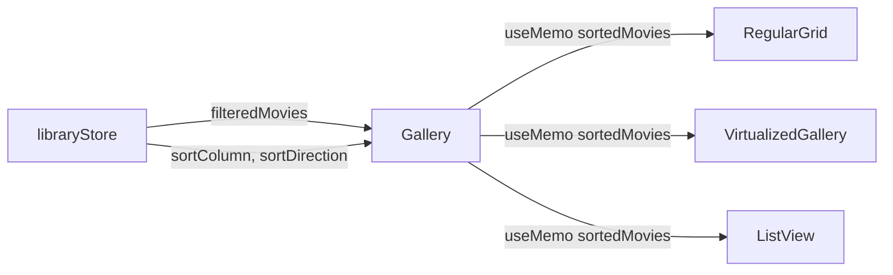

# Add Sorting to Gallery View

## Architecture

Since sorting should be shared between views, the sort state will be lifted to the Zustand store. Both views will derive sorted movies using `useMemo` to avoid re-sorting on every render.

## Key Files

- [src/stores/libraryStore.ts](src/stores/libraryStore.ts) - Add `sortColumn` and `sortDirection` state
- [src/components/Gallery.tsx](src/components/Gallery.tsx) - Add sort controls dropdown to header, compute sortedMovies via useMemo
- [src/components/ListView.tsx](src/components/ListView.tsx) - Remove local sort state, use store's shared state
- [src/types/index.ts](src/types/index.ts) - Add sort type definitions (if not already present)

## Implementation Details

### 1. Store Changes

Add to `libraryStore.ts`:

- `sortColumn: 'title' | 'created_at' | 'file_size' | 'duration'` (default: `'created_at'`)
- `sortDirection: 'asc' | 'desc'` (default: `'desc'`)
- `setSortColumn` and `setSortDirection` actions

### 2. Gallery Sort Controls

Add a dropdown button in the Gallery header (next to view toggle) with:

- Sort field selector (Title, Added, Size, Duration)
- Direction toggle (ascending/descending arrow)
- Reuse the `SortIcon` pattern from ListView

### 3. Sorting Logic

Create a shared memoized sort in Gallery that computes `sortedMovies` from `filteredMovies`, then pass to:

- Regular grid (MovieCard loop)
- VirtualizedGallery (props)
- ListView (via store or props)

The sort comparison logic already exists in ListView lines 145-176 and can be reused.

### 4. ListView Update

Remove local `sortColumn`/`sortDirection` state, read from store instead. Keep the header sort buttons functional by calling store actions.