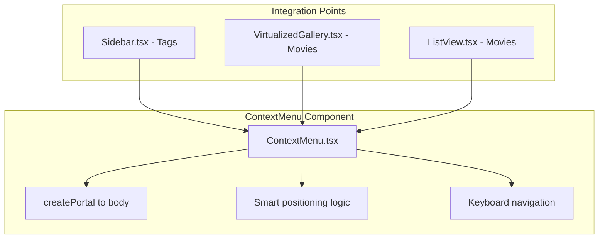

# Context Menu System Implementation

## Problem Statement

The current tag list shows edit/delete actions on hover, which creates visual clutter and makes the UI hard to read (as shown in the attached screenshot). Additionally, movies lack quick-access actions beyond hover buttons.

## Solution Overview

Create a polished, reusable `ContextMenu` component that follows the existing portal pattern from [DetailsPanel.tsx](src/components/DetailsPanel.tsx) (`TagDropdownPortal`), providing context menus for both tags and movies.

## Architecture



## Component Design: `ContextMenu.tsx`

A new reusable component at [src/components/ContextMenu.tsx](src/components/ContextMenu.tsx):

```typescript
interface ContextMenuItem {
  id: string
  label: string
  icon?: React.ReactNode
  onClick: () => void
  disabled?: boolean
  danger?: boolean  // Red accent for destructive actions
  divider?: boolean // Show divider after this item
}

interface ContextMenuProps {
  items: ContextMenuItem[]
  position: { x: number; y: number }
  onClose: () => void
}
```

**Features:**

- Portal-based rendering for proper z-index layering
- Smart edge detection (reposition if menu would overflow viewport)
- Framer Motion animations (scale + fade)
- Keyboard navigation (Arrow keys, Enter, Escape)
- Click outside to dismiss
- Consistent with existing cinematic bronze theme

## Tag Context Menu Actions

Integrate into [Sidebar.tsx](src/components/Sidebar.tsx):

| Action | Icon | Description |

|--------|------|-------------|

| Edit tag | Pencil | Opens inline edit mode (existing functionality) |

| Delete tag | Trash | Shows confirmation dialog (existing functionality) |

| --- | --- | Divider |

| Filter by tag | Filter | Sets this tag as active filter |

**Benefit:** Remove hover actions from tag list, showing only count badge. Right-click reveals actions cleanly.

## Movie Context Menu Actions

Integrate into [VirtualizedGallery.tsx](src/components/VirtualizedGallery.tsx) and [ListView.tsx](src/components/ListView.tsx):

| Action | Icon | Description |

|--------|------|-------------|

| Play | Play | Opens video in default player |

| --- | --- | Divider |

| Mark as watched/unwatched | Eye | Toggles watched status |

| Add to/Remove from favorites | Heart | Toggles favorite status |

| --- | --- | Divider |

| Edit details | Edit | Selects movie and focuses details panel |

| Fetch TMDB data | Film | Opens TMDB search modal |

| --- | --- | Divider |

| Show in Explorer | Folder | Opens containing folder |

| --- | --- | Divider |

| Remove from library | Trash (danger) | Shows delete confirmation |

**Multi-selection support:** When multiple movies are selected, show batch-applicable actions with "X movies selected" indicator.

## Styling

Following the established cinematic bronze theme:

- Background: `bg-obsidian-400/95 backdrop-blur-xl`
- Border: `border-smoke-800/50`
- Hover: `bg-bronze-500/10` with bronze text accent
- Danger items: `text-cinnabar-400` on hover
- Shadow: `shadow-2xl shadow-black/50`
- Rounded corners: `rounded-xl`

## Implementation Steps

1. Create the `ContextMenu` component with portal rendering, positioning, and animations
2. Add CSS styles for context menu items to [index.css](src/styles/index.css)
3. Update [Sidebar.tsx](src/components/Sidebar.tsx) to use context menu for tags (remove hover actions)
4. Update [VirtualizedGallery.tsx](src/components/VirtualizedGallery.tsx) to use context menu for movies
5. Update [ListView.tsx](src/components/ListView.tsx) to use context menu for movies
6. Export component from [index.ts](src/components/index.ts)