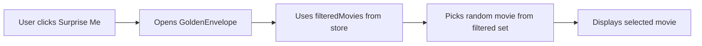

# Extend Golden Envelope to Any Filtered View

## Current Behavior

- The "Surprise Me" button only appears on the "unwatched" filter view
- The `GoldenEnvelope` component hardcodes filtering to only unwatched movies
- The empty state message says "All Caught Up!" which is specific to the unwatched context

## Changes Required

### 1. Update Gallery.tsx - Show button on any filter with movies

In [`src/components/Gallery.tsx`](src/components/Gallery.tsx), change line 156 from:

```tsx
{activeFilter === 'unwatched' && onPickForMe && sortedMovies.length > 0 && (
```

to:

```tsx
{onPickForMe && sortedMovies.length > 0 && (
```

Also update the button's `title` attribute (line 166) to be more generic:

```tsx
title="Pick a random movie from current view"
```

### 2. Update GoldenEnvelope.tsx - Use filteredMovies from store

In [`src/components/GoldenEnvelope.tsx`](src/components/GoldenEnvelope.tsx):

- Change the import to use `filteredMovies` instead of `movies` (line 45)
- Replace the `unwatchedMovies` memoized filter (lines 54-57) to simply use `filteredMovies` directly
- Rename the variable from `unwatchedMovies` to `availableMovies` for clarity
- Update the empty state message (lines 723-728) from "All Caught Up!" to a more generic message like "No Movies Available" with appropriate description

### 3. Update empty state messaging

The empty state currently says:

> "You've watched all the movies in your library. Add more movies or unmark some as watched to get new picks."

Change to:

> "No movies match the current filter. Try adjusting your filters or adding more movies to your library."

## Data Flow After Changes



The filtered movies already reflect whatever view the user is in (tag filter, unwatched, favorites, etc.), so we just need to use that existing filtered list.