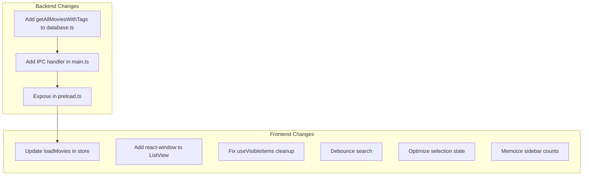

# Performance Optimization Plan for libcat

## Problem Summary

With 5000+ movies, the app suffers from:

- **Lag during loading**: 5000 individual IPC calls to fetch tags (N+1 query problem)
- **Scroll lag in ListView**: All 5000 rows rendered at once (no virtualization)
- **Memory leaks**: IntersectionObserver never cleans up removed elements
- **Slow filtering**: Search/filter runs on every keystroke without debouncing
- **Expensive re-renders**: Sidebar counts recomputed on every render

---

## Critical Fixes (High Impact)

### 1. Batch Tag Loading - Fix N+1 Query Problem

**Current problem** in [`libraryStore.ts`](src/stores/libraryStore.ts) (lines 161-166):

```typescript
const moviesWithTags = await Promise.all(
  movies.map(async (movie) => ({
    ...movie,
    tags: await window.api.getTagsForMovie(movie.id), // 5000 IPC calls!
  }))
)
```

**Solution**: Add a single `getMoviesWithTags()` method in the backend that uses SQL JOIN:

- Add `getAllMoviesWithTags()` to [`database.ts`](electron/services/database.ts) using a LEFT JOIN query
- Add IPC handler in [`main.ts`](electron/main.ts)
- Expose in [`preload.ts`](electron/preload.ts)
- Update `loadMovies()` in the store to use single call

---

### 2. Virtualize ListView with react-window

**Current problem** in [`ListView.tsx`](src/components/ListView.tsx): Renders all 5000 `motion.div` elements at once.

**Solution**: Use `react-window` (FixedSizeList) to only render visible rows (~20-30 at a time).

- Install `react-window` and `@types/react-window`
- Replace the mapped list with `FixedSizeList`
- Move row rendering into a memoized `Row` component

---

### 3. Fix IntersectionObserver Memory Leak

**Current problem** in [`useVisibleItems.ts`](src/hooks/useVisibleItems.ts):

- `elementMapRef` grows unbounded as movies are filtered/removed
- Elements are added via `observe()` but cleanup is never called

**Solution**:

- Return cleanup function from `observe()` and call it in MovieCard's useEffect cleanup
- Or: Periodically prune stale entries from the map when elements are no longer in DOM

---

### 4. Debounce Search Filter

**Current problem** in [`libraryStore.ts`](src/stores/libraryStore.ts) (lines 147-150):

```typescript
setSearchQuery: (query) => {
  set({ searchQuery: query })
  get().applyFilter() // Runs immediately on every keystroke
}
```

**Solution**: Separate state update from filter execution:

- Update query immediately for responsive UI
- Debounce the `applyFilter()` call by ~200ms
- Use `useDeferredValue` or lodash `debounce`

---

## Medium Priority Fixes

### 5. Optimize Selection State

**Current problem** in [`MovieCard.tsx`](src/components/MovieCard.tsx) (line 15):

```typescript
const isSelected = selectedMovies.some(m => m.id === movie.id) // O(n) per card
```

**Solution**:

- Store selection as `Set<number>` (selectedIds) instead of `Movie[]`
- O(1) lookup: `selectedIds.has(movie.id)`

---

### 6. Memoize Sidebar Counts

**Current problem** in [`Sidebar.tsx`](src/components/Sidebar.tsx) (lines 46, 57, 67, 107):

```typescript
count: movies.filter((m) => !m.tags || m.tags.length === 0).length
count: movies.filter((m) => m.watched).length
// ... runs on every render
```

**Solution**: Wrap counts in `useMemo` with `[movies]` dependency.

---

### 7. Reduce Animation Overhead in ListView

**Current approach** already disables stagger for >100 items, but still creates animation variants for all 5000 items.

**Solution**: For lists >500 items, use plain `div` instead of `motion.div` in row rendering.

---

## Implementation Flow



---

## Expected Impact

| Fix | Current | After | Improvement |

|-----|---------|-------|-------------|

| Tag Loading | 5000 IPC calls | 1 IPC call | ~100x faster initial load |

| ListView Render | 5000 DOM nodes | ~30 DOM nodes | ~166x fewer elements |

| Memory Leak | Unbounded growth | Proper cleanup | Stable memory usage |

| Search Filter | Every keystroke | Debounced 200ms | Smoother typing |

| Selection Check | O(n) per card | O(1) per card | Linear to constant |

---

## Notes

- All changes preserve existing UX (smooth animations where appropriate, same visual appearance)
- react-window maintains smooth scrolling with 5000+ items
- Debouncing search is imperceptible (200ms) but prevents CPU spikes
- Selection optimization is invisible to users