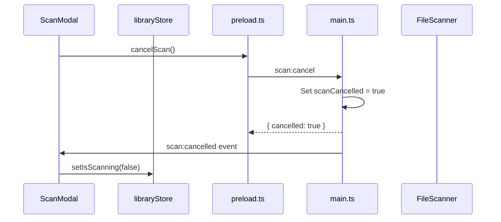

# Scan Cancellation Feature

## Overview

Currently, once a scan starts there is no way to stop it. This plan adds a "Cancel" button to the scan modal that will abort the scan mid-operation, keeping any movies already processed while stopping further processing.

## Architecture

## Key Changes

### 1. Main Process ([`electron/main.ts`](electron/main.ts))

- Add a `scanCancelled` flag variable
- Add `scan:cancel` IPC handler that sets the flag and returns acknowledgment
- Modify the `folder:scan` loop to check `scanCancelled` after each file
- When cancelled, send a `scan:cancelled` event and return partial results
- Reset the flag at the start of each new scan

### 2. Preload ([`electron/preload.ts`](electron/preload.ts))

- Add `cancelScan()` method that invokes `scan:cancel`
- Add `onScanCancelled(callback)` listener for the cancelled event
- Update type definitions

### 3. Scan Modal ([`src/components/ScanModal.tsx`](src/components/ScanModal.tsx))

- Add a "Cancel" button below the progress bar
- Wire button to call `window.api.cancelScan()`
- Show "Cancelling..." state while waiting for confirmation

### 4. App Component ([`src/App.tsx`](src/App.tsx))

- Subscribe to `scan:cancelled` event to clean up UI state
- Handle partial results (movies already added before cancel)

## Behavior

- Movies processed before cancellation are kept in the library
- Cancellation is near-instant (checked between each file)
- UI shows "Cancelling..." briefly while the current file finishes
- Toast message indicates scan was cancelled with count of files added