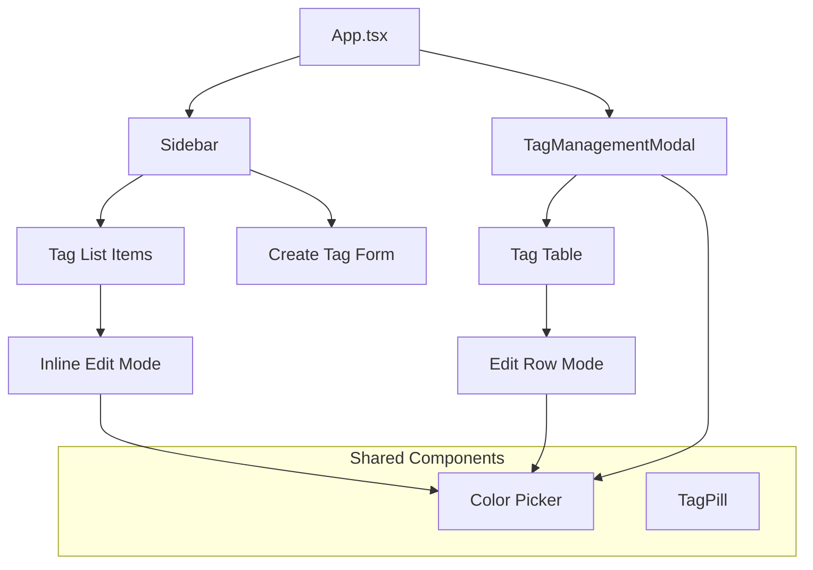

# Tag Management System Specification

## Current State Analysis

The backend already supports tag editing via `window.api.updateTag(id, name, color)` but **no UI exists** for this functionality. Users can only create and delete tags. The store also has `updateTagInState` ready to use.

**Existing infrastructure to leverage:**

- Database: `updateTag(id, name, color)` in [`electron/services/database.ts`](electron/services/database.ts)
- IPC: `tags:update` handler in [`electron/main.ts`](electron/main.ts) 
- Preload: `updateTag` exposed in [`electron/preload.ts`](electron/preload.ts)
- Store: `updateTagInState` in [`src/stores/libraryStore.ts`](src/stores/libraryStore.ts)

---

## Feature Specification

### 1. Inline Tag Editing in Sidebar

**Location:** [`src/components/Sidebar.tsx`](src/components/Sidebar.tsx) - tag list items (lines 400-466)

**Interaction Pattern:**

- Double-click or right-click on a tag to enter edit mode
- Edit mode shows: name input field + color picker inline
- Press Enter or click outside to save
- Press Escape to cancel
- Visual feedback during save operation

**UI Changes:**

- Replace static tag name with editable input when in edit mode
- Show compact inline color swatches (same PRESET_COLORS array)
- Add subtle edit icon on hover (pencil) next to delete X

### 2. Tag Management Modal

**New Component:** `src/components/TagManagementModal.tsx`

**Access Points:**

- New "Manage Tags" button in Sidebar tags header (next to create button)
- Optional: Right-click context menu on tags section header

**Modal Features:**

```
+--------------------------------------------------+
|  Manage Tags                              [X]    |
+--------------------------------------------------+
|  [Search tags...]                                |
+--------------------------------------------------+
|  +-------------------------------------------+   |
|  | [Color] Tag Name            [12] [Edit]   |   |
|  | [Color] Another Tag          [5] [Edit]   |   |
|  | [Color] Third Tag            [0] [Edit]   |   |
|  +-------------------------------------------+   |
+--------------------------------------------------+
|  [+ Create New Tag]              [Close]         |
+--------------------------------------------------+
```

**Features:**

- List all tags with usage counts
- Inline edit mode for each tag (click Edit or double-click row)
- Delete with confirmation (warning shows affected movie count)
- Create new tag from within modal
- Search/filter tags
- Sort by: name, usage count, creation date

### 3. Enhanced Color Picker

**Improvements to existing color picker:**

- Keep the 10 PRESET_COLORS as quick-select
- Add custom color input (hex field) below presets
- Show color preview with tag name sample
- Consider grouping colors by hue (warm, cool, neutral)

**Color Picker UI:**

```
[Preset swatches - 2 rows of 5]
------------------------
Custom: [#______] [Preview]
```

### 4. Tag Pill Enhancements

**Location:** [`src/components/TagPill.tsx`](src/components/TagPill.tsx)

**Add optional edit functionality:**

- New `onEdit` prop for enabling edit mode
- Click on tag name (when enabled) opens inline edit popover
- Used in DetailsPanel for quick tag edits

### 5. Bulk Tag Operations (Enhancement)

**In BulkActionsPanel (DetailsPanel.tsx):**

- Already supports adding/removing tags from multiple movies
- Consider: "Replace tag X with tag Y" for selected movies

---

## Implementation Details

### State Management

Add to `libraryStore.ts`:

```typescript
// Editing state (optional - can be local component state)
editingTagId: number | null
setEditingTagId: (id: number | null) => void
```

### API Calls

Existing API is sufficient:

```typescript
// Already available
window.api.updateTag(id: number, name: string, color: string): Promise<Tag>
```

### Validation Rules

1. **Tag name:**

   - Required, non-empty after trim
   - Max length: 50 characters
   - Must be unique (case-insensitive) - handle UNIQUE constraint error

2. **Tag color:**

   - Valid hex color format (#RRGGBB)
   - Default to first preset if invalid

### Error Handling

- Duplicate name: Show inline error "A tag with this name already exists"
- Network/DB error: Show toast notification
- Optimistic updates with rollback on failure

---

## Visual Design

**Consistent with existing UI:**

- Glass-card styling for modal
- Framer Motion animations (scale, fade, slide)
- Bronze accent colors for primary actions
- Cinnabar for destructive actions
- Smoke/pearl for text hierarchy

**Edit Mode States:**

- Normal: Tag pill with subtle hover effect
- Hover: Show edit/delete icons
- Editing: Input field with save/cancel affordances
- Saving: Loading spinner, disabled inputs

---

## Files to Create/Modify

| File | Action | Description |

|------|--------|-------------|

| `src/components/TagManagementModal.tsx` | Create | Full tag management modal |

| `src/components/Sidebar.tsx` | Modify | Add inline edit, manage button |

| `src/components/TagPill.tsx` | Modify | Add optional edit mode |

| `src/components/index.ts` | Modify | Export new component |

---

## Component Architecture



---

## Priority Order

1. **MVP - Inline sidebar editing** (highest impact, minimal UI change)
2. **Tag Management Modal** (comprehensive solution)
3. **Enhanced color picker** (polish)
4. **TagPill edit mode** (nice-to-have)