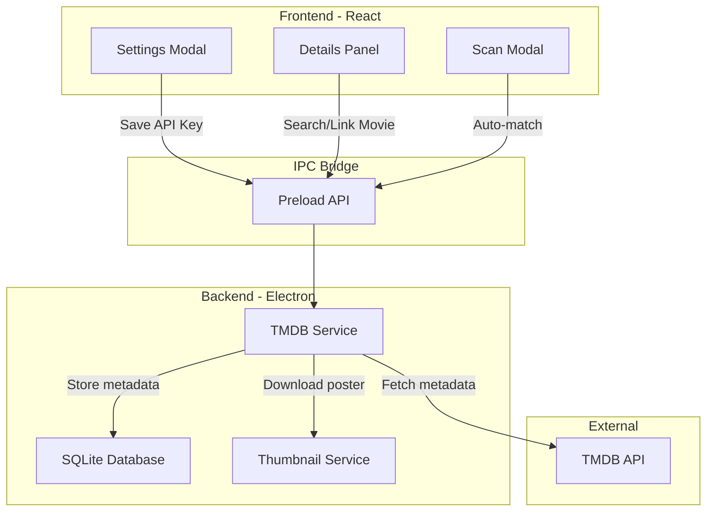

# TMDB API Integration

## Architecture Overview

## Implementation Steps

### 1. Database Schema Updates

Extend the movies table in [`electron/services/database.ts`](electron/services/database.ts) to store TMDB data:

- `tmdb_id` - TMDB movie ID for linking
- `tmdb_poster_path` - Local path to downloaded poster
- `tmdb_rating` - TMDB rating (0-10 scale)
- `tmdb_overview` - Movie synopsis
- `tmdb_director` - Director name
- `tmdb_cast` - JSON array of cast members
- `tmdb_release_date` - Original release date
- `tmdb_genres` - JSON array of genres

Add a settings table to store the API key per profile.

### 2. Create TMDB Service

New file: `electron/services/tmdb.ts`

- `searchMovies(query, year?)` - Search TMDB by title/year
- `getMovieDetails(tmdbId)` - Fetch full movie details
- `downloadPoster(posterPath, movieId)` - Download poster to local storage
- `matchMovie(title, year?)` - Attempt automatic matching
- API key validation and error handling

### 3. Update IPC Handlers

Add new handlers in [`electron/main.ts`](electron/main.ts):

- `tmdb:setApiKey` - Save API key to profile settings
- `tmdb:getApiKey` - Retrieve stored API key
- `tmdb:search` - Search TMDB for movies
- `tmdb:linkMovie` - Link a movie to TMDB and fetch metadata
- `tmdb:unlinkMovie` - Remove TMDB association
- `tmdb:refreshMetadata` - Re-fetch metadata for linked movie

### 4. Update Preload Bridge

Extend [`electron/preload.ts`](electron/preload.ts) with new TMDB API methods.

### 5. Update Type Definitions

Extend [`src/types/index.ts`](src/types/index.ts) with:

- `TMDBSearchResult` interface
- Extended `Movie` interface with TMDB fields

### 6. Create Settings Modal Component

New file: `src/components/SettingsModal.tsx`

- Input field for TMDB API key (masked)
- Save/validate button
- Link to TMDB to get an API key
- Show connection status

### 7. Update Details Panel

Modify [`src/components/DetailsPanel.tsx`](src/components/DetailsPanel.tsx):

- Display TMDB metadata (rating, director, cast, overview)
- "Search TMDB" button for manual matching
- "View on TMDB" link to open movie page in browser
- Option to use TMDB poster vs local thumbnail
- Unlink option if incorrectly matched

### 8. Update Scan Flow

Modify [`electron/main.ts`](electron/main.ts) folder scan handler:

- After adding movie, attempt TMDB match if API key is set
- Parse title/year from filename for better matching
- Download poster on successful match

### 9. Update Sidebar

Add settings gear icon to [`src/components/Sidebar.tsx`](src/components/Sidebar.tsx) to open settings modal.

## Key Files to Modify

- [`electron/services/database.ts`](electron/services/database.ts) - Schema + new methods
- [`electron/main.ts`](electron/main.ts) - IPC handlers
- [`electron/preload.ts`](electron/preload.ts) - API bridge
- [`src/types/index.ts`](src/types/index.ts) - Type definitions
- [`src/components/DetailsPanel.tsx`](src/components/DetailsPanel.tsx) - Display TMDB data
- [`src/components/Sidebar.tsx`](src/components/Sidebar.tsx) - Settings access

## New Files to Create

- `electron/services/tmdb.ts` - TMDB API service
- `src/components/SettingsModal.tsx` - Settings UI
- `src/components/TMDBSearchModal.tsx` - Manual search/link UI