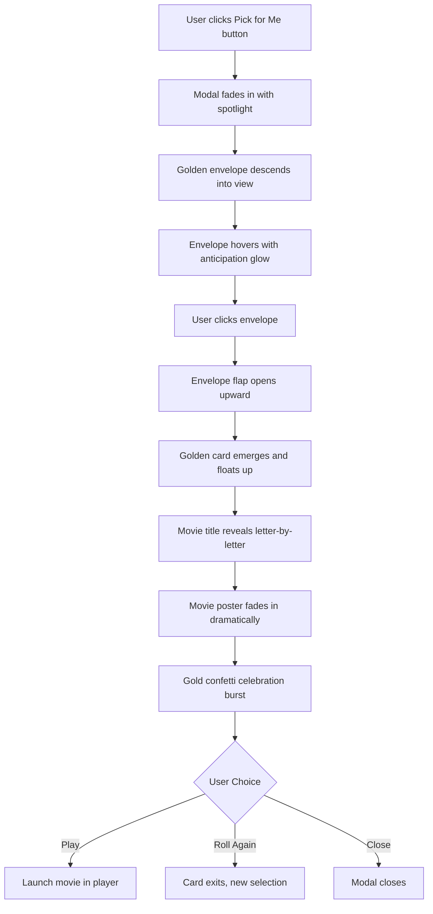

# Unwatched Filter + The Golden Envelope Random Picker

# User prompt

there should be an "unwatched" category. i have a large library of movies, but i dont have time to watch them. sometimes i want to filter only movies i havent seen before.

 it would be fun to add a way to select a "random" movie, in a creative, and unique way. like a wheelspin, slot machine, or some other way to generate a random result. maybe something more related to cinema.

 put some extreme effort into making an award winning design and experience, something unique to this software that makes it memorable


## Part 1: Unwatched Filter

Add a simple "Unwatched" category alongside the existing "Watched" filter.

### Changes Required

1. **[`src/types/index.ts`](src/types/index.ts)** - Add `'unwatched'` to `FilterType`
2. **[`src/stores/libraryStore.ts`](src/stores/libraryStore.ts)** - Add filter logic at line ~296 to filter `!movie.watched`
3. **[`src/components/Sidebar.tsx`](src/components/Sidebar.tsx)** - Add "Unwatched" filter button with eye-slash icon after the Watched filter
4. **[`src/components/Gallery.tsx`](src/components/Gallery.tsx)** - Add case for `'unwatched'` in `getFilterTitle()`

---

## Part 2: The Golden Envelope - Random Movie Picker

A cinema-authentic awards-show experience that transforms choosing a random movie into an event.

### Concept: Awards Night

The experience mimics the tension and excitement of opening an award envelope at the Oscars - the anticipation, the dramatic reveal, the celebration. This creates an emotional moment that makes the selection feel special rather than arbitrary.

### Visual Design

```
+--------------------------------------------------+
|              dark vignette backdrop              |
|                                                  |
|        [film strip decorations at edges]         |
|                                                  |
|    floating particles / dust motes in light      |
|                                                  |
|           ╔═══════════════════════╗              |
|           ║                       ║ <- spotlight |
|           ║   GOLDEN ENVELOPE     ║    cone      |
|           ║   with embossed seal  ║              |
|           ╚═══════════════════════╝              |
|                                                  |
|         "Click to reveal your pick"              |
+--------------------------------------------------+
```

### User Experience Flow



### Animation Phases

**Phase 1 - Stage Set** (0-0.5s)

- Backdrop fades in with dramatic vignette
- Spotlight cone illuminates center stage
- Film strip decorations slide in from edges
- Ambient particles begin floating

**Phase 2 - Envelope Entrance** (0.5-1.2s)

- Golden envelope descends from above with slight rotation
- Settles into position with satisfying bounce
- Embossed wax seal pulses with subtle glow
- "And the selection is..." text fades in below

**Phase 3 - The Reveal** (on click, 1.5s)

- Envelope flap lifts open (3D transform)
- Flash of golden light from within
- Award card slides out and floats upward
- Card rotates to face viewer

**Phase 4 - The Announcement** (0.8s)

- Movie title types out letter-by-letter on the card
- Year appears below with fade
- Movie poster materializes behind card with scale effect

**Phase 5 - Celebration** (0.5s)

- Burst of gold confetti/stars from center
- Spotlight intensifies briefly
- Soft ambient glow settles

### Visual Elements

**The Envelope**

- Rich gold gradient with subtle texture
- Embossed film reel seal in center
- Soft shadow creating depth
- Hover state: gentle float animation + intensified glow

**The Card**

- Cream/ivory background with gold border
- Art deco inspired typography for title
- Film perforation pattern along edges
- Subtle paper texture

**Atmosphere**

- Deep obsidian backdrop with radial vignette
- Volumetric spotlight cone (CSS gradient)
- Floating dust particles (CSS animation)
- Film strip borders with perforations

### Files to Create/Modify

1. **NEW: [`src/components/GoldenEnvelope.tsx`](src/components/GoldenEnvelope.tsx)** - Main modal component (~400 lines)

   - Multi-phase animation orchestration
   - Envelope open/close states
   - Card reveal with movie data
   - Confetti celebration effect

2. **[`src/components/Sidebar.tsx`](src/components/Sidebar.tsx)** - Add "Pick for Me" button below filters

   - Film clapper icon
   - Disabled state when no unwatched movies

3. **[`src/App.tsx`](src/App.tsx)** - Add modal state and render GoldenEnvelope

4. **[`src/styles/index.css`](src/styles/index.css)** - Add custom animations:

   - Spotlight cone gradient
   - Envelope emboss effects
   - Letter-by-letter text reveal
   - Confetti burst keyframes
   - Film strip pattern

### Key Technical Details

- Use `framer-motion` for all animation orchestration with `AnimatePresence`
- Random selection from `filteredMovies` where `!watched` (respects current tag/search filters)
- Preload movie thumbnail during envelope hover for instant reveal
- "Roll Again" maintains current filter context
- ESC key or backdrop click to close
- Disable button if no unwatched movies available

### Accessibility

- Focus trap within modal
- ARIA labels for all interactive elements
- Reduced motion: skip to reveal instantly
- Keyboard: Enter to open envelope, Escape to close